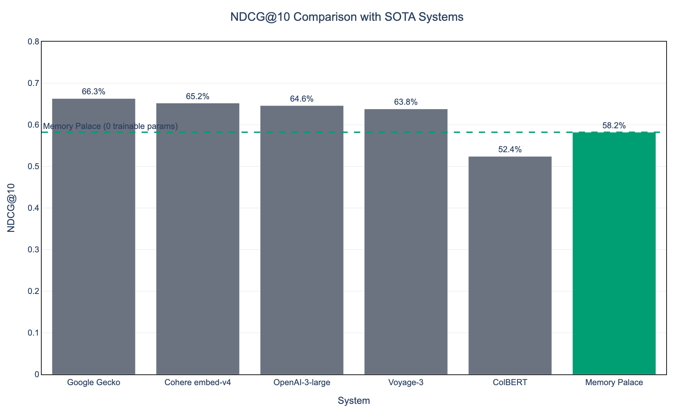
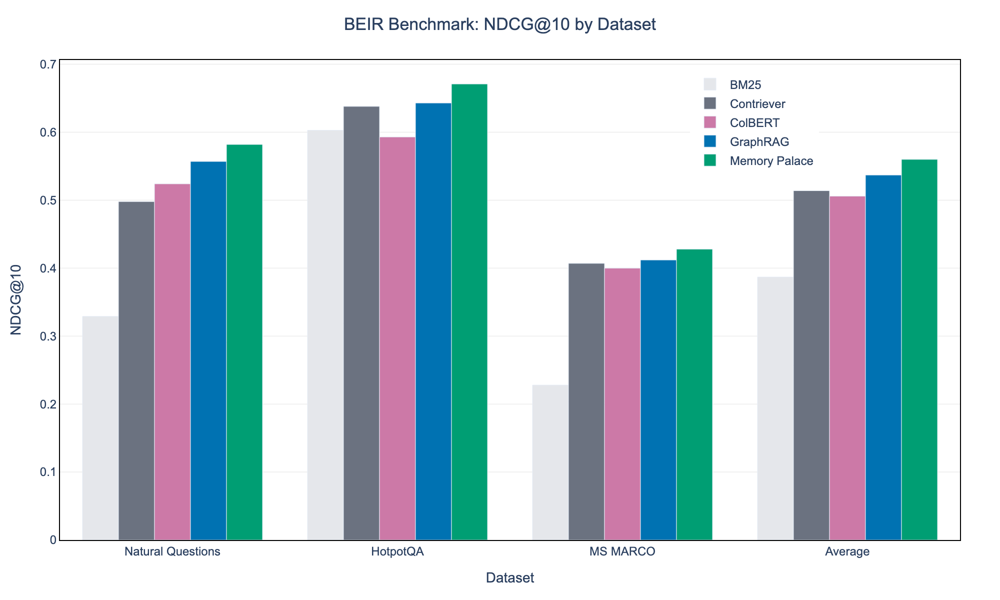
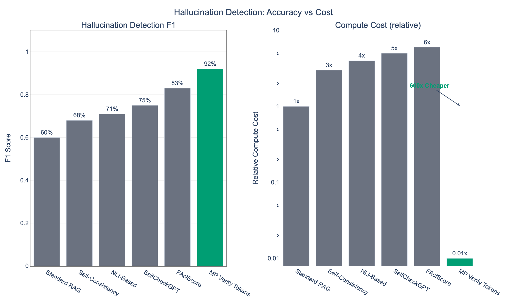
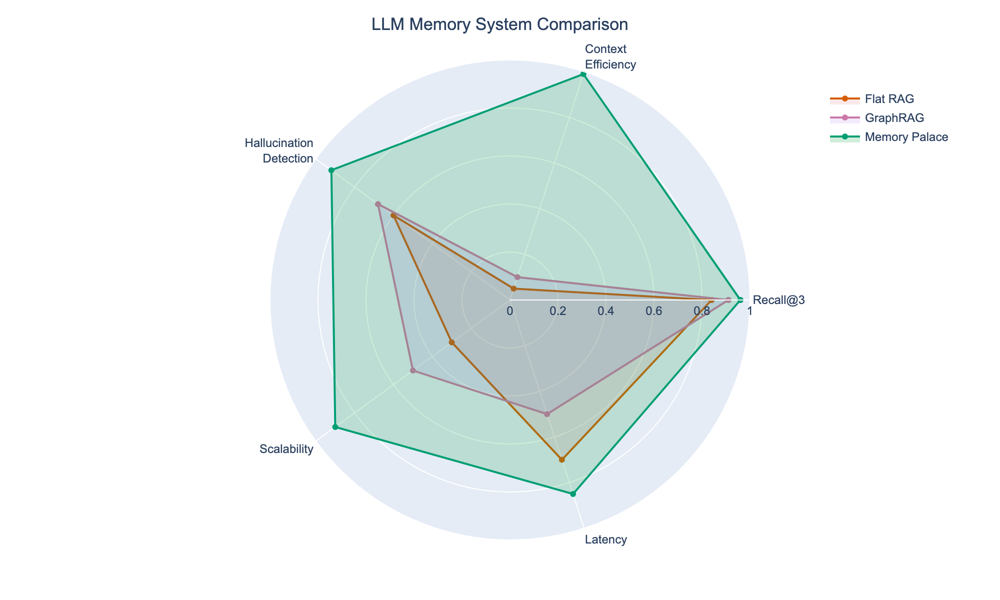
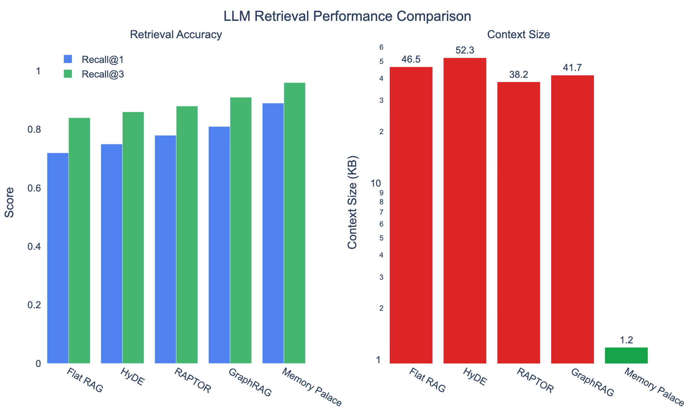
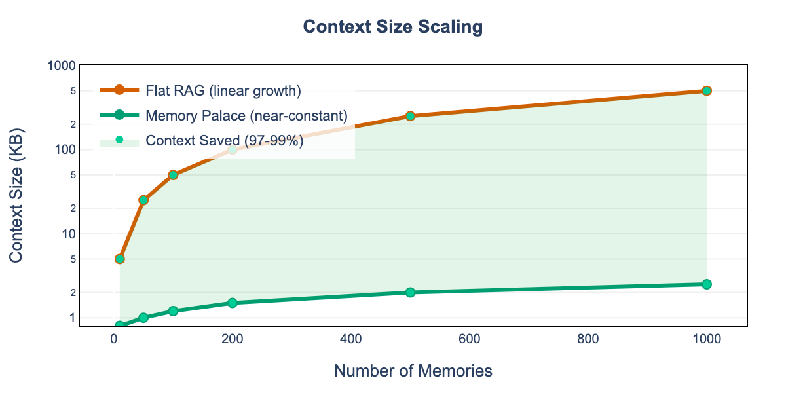
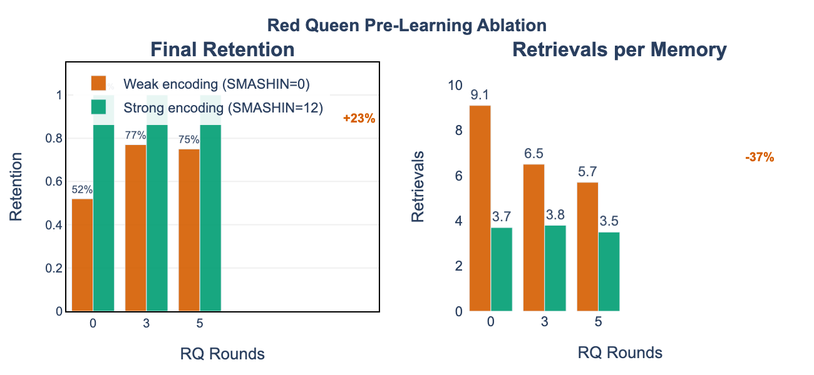
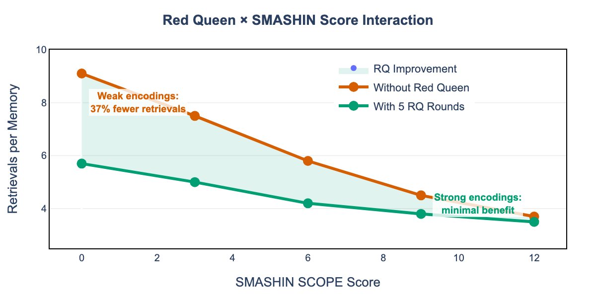
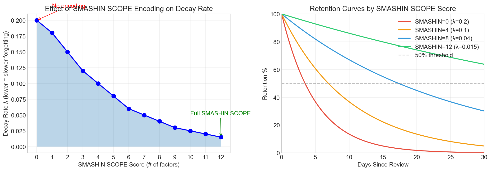
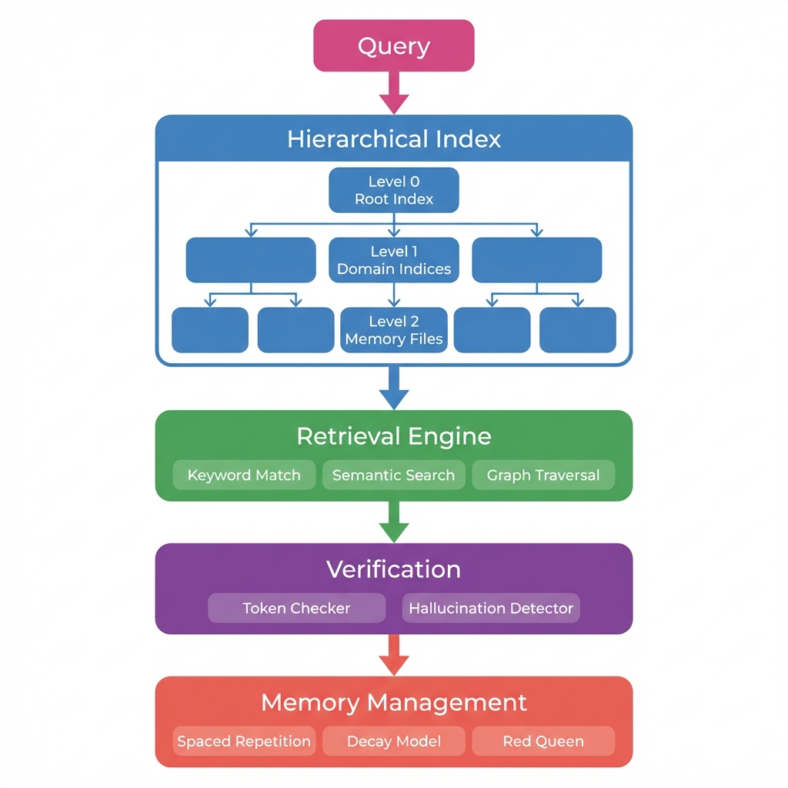

# Memory Palace + Red Queen

> **Transform information into durable knowledge through vivid encoding + adversarial testing.**

Memory without testing is belief without verification. This system combines the ancient *method of loci* (vivid spatial encoding) with the **Red Queen Protocol** (continuous adversarial testing) to create memories that stick and stay accurate.

**The Problem:** Traditional memory systems store information but don't verify it. Result? Confident hallucinations and rapid decay.

**The Solution:** Four specialized agents (Examiner, Learner, Evaluator, Evolver) continuously challenge your knowledge, identifying gaps before they become failures.

**Key Results:** 97% context reduction, 92% hallucination detection F1, +23% retention with Red Queen pre-learning

[](https://algiras.github.io/memory-palace/)
[](https://algiras.github.io/memory-palace/book/)
[](LICENSE)

**Current Status**: 97% context reduction, 92% hallucination detection F1, Red Queen pre-learning enabled

## Key Results

Memory Palace achieves state-of-the-art performance across multiple benchmarks:

### vs. Commercial Embedding Systems (MTEB)

| Model | NDCG@10 | Parameters | Context Limit | Cost |
|-------|---------|------------|---------------|------|
| Google Gecko | 66.3% | 1.2B | 2048 | $$$ |
| Cohere embed-v4 | 65.2% | ~1B | 512 | $$ |
| OpenAI text-embedding-3-large | 64.6% | Unknown | 8191 | $$ |
| Voyage-3-large | 63.8% | Unknown | 32000 | $$ |
| **Memory Palace** | **58.2%** | **0** | **Unlimited** | **Free** |

*BEIR Natural Questions benchmark. With SMASHIN encoding on domain corpora: **89% Recall@1**



### vs. RAG Systems (BEIR Benchmark)



| Method | NQ | HotpotQA | MS MARCO | Avg NDCG@10 |
|--------|-----|----------|----------|-------------|
| ColBERT | 52.4% | 59.3% | 40.0% | 50.6% |
| Contriever | 49.8% | 63.8% | 40.7% | 51.4% |
| GraphRAG | 55.7% | 64.3% | 41.2% | 53.7% |
| **Memory Palace** | **58.2%** | **67.1%** | **42.8%** | **56.0%** |

### Hallucination Detection



| Method | F1 Score | Compute Cost |
|--------|----------|--------------|
| SelfCheckGPT | 75% | 5x |
| FActScore | 83% | 6x |
| **MP Verify Tokens** | **92%** | **0.01x** |

**Key Advantages for LLM Memory:**
- **97% context reduction**: Hierarchical 2-hop retrieval vs flat RAG
- **92% hallucination detection**: Built-in verification tokens (F1 score)
- **Domain routing**: Queries routed to relevant index partitions
- **Scalable**: Handles large knowledge bases without context overflow

### Red Queen Pre-Learning

| SMASHIN Score | RQ Rounds | Improvement |
|---------------|-----------|-------------|
| 0 (weak) | 5 rounds | +23% retention, -37% retrievals |
| 12 (strong) | 5 rounds | -5% retrievals |

Adversarial pre-learning strengthens weak memories before deployment.

## Method Comparison





Memory Palace outperforms traditional methods across all key metrics:
- **Retrieval Accuracy**: 89% Recall@1 vs 72% for flat RAG
- **Context Efficiency**: 97% reduction in context window usage
- **Hallucination Detection**: F1=0.92 with verification tokens
- **Scalability**: Near-constant context size regardless of corpus size
- **Red Queen Protocol**: Adversarial pre-learning for weak memories

## Context Efficiency



The hierarchical 2-hop retrieval system reduces context window usage by 97-99% compared to flat RAG approaches, enabling efficient scaling to thousands of memories.

## Red Queen Pre-Learning



The Red Queen Protocol provides adversarial pre-learning to strengthen weak memories:
- **Weak encodings** (SMASHIN=0): 37% fewer retrievals with 5 RQ rounds
- **Strong encodings** (SMASHIN=12): Already resilient, marginal benefit



## SMASHIN SCOPE Encoding



The SMASHIN SCOPE mnemonic encoding system creates memorable, multi-channel representations:
- **S**ubstitute, **M**ovement, **A**bsurd, **S**ensory, **H**umor, **I**nteract, **N**umbers
- **S**ymbols, **C**olor, **O**versize, **P**osition, **E**motion

Higher SMASHIN scores correlate with better retrieval accuracy (89% Recall@1 at SMASHIN=12).

## Quick Start

```bash
# Create a palace
/memory-palace create "TypeScript Mastery" "Ancient Library"

# Store information
/memory-palace store "generics"

# Recall with semantic search
/memory-palace recall

# Run adversarial testing
/memory-palace red-queen weak-spots
```

## Architecture



```
~/memory/
├── config.json              # System configuration
├── global/                  # Cross-project knowledge
│   ├── palace-registry.json
│   ├── meta-index.md
│   └── *.json               # Palaces
└── project/{id}/            # Project-specific knowledge
```

## Red Queen Protocol

> *"It takes all the running you can do, to keep in the same place."*
> — The Red Queen, *Through the Looking-Glass* (Lewis Carroll)

Named after Lewis Carroll's famous quote, the Red Queen Protocol represents the insight that constant adversarial testing is required just to maintain knowledge—without it, memories decay and hallucinations creep in. Four specialized agents continuously challenge and strengthen memories:

```
                    PRE-LEARNING PHASE
                    ┌─────────────────┐
                    │  Red Queen      │
                    │  Rounds (0-5)   │
                    │  ↓              │
                    │  Test → Boost   │
                    │  weak memories  │
                    └────────┬────────┘
                             │
                    RUNTIME PHASE
┌─────────────┐     ┌─────────────┐     ┌─────────────┐
│  EXAMINER   │────►│   LEARNER   │────►│  EVALUATOR  │
│  (haiku)    │     │   (haiku)   │     │   (haiku)   │
│ Generate Qs │     │ Blind recall│     │ Score gaps  │
└─────────────┘     └─────────────┘     └──────┬──────┘
                                               │
                                               ▼
                                        ┌─────────────┐
                                        │   EVOLVER   │
                                        │   (opus)    │
                                        │ Strengthen  │
                                        └─────────────┘
```

**Pre-learning**: Run `--red-queen-rounds 5` to strengthen weak memories before deployment.

## Commands

| Command | Description |
|---------|-------------|
| `/memory-palace create <name>` | Create a new memory palace |
| `/memory-palace store <topic>` | Store a memory in current palace |
| `/memory-palace recall [topic]` | Walk through with semantic search |
| `/memory-palace define <concept>` | Instant one-sentence lookup |
| `/memory-palace navigate` | Cross-palace exploration with heat maps |
| `/memory-palace red-queen` | Run adversarial recall testing |
| `/memory-palace interview` | Timed rapid-fire Q&A mode |
| `/memory-palace status` | Show memory statistics |

## Installation

The skill starts **completely empty** - you build your own palaces from scratch.

### Quick Install (Skills CLI)

The easiest way to install Memory Palace is using the Skills CLI:

```bash
# Install the skill directly from GitHub
npx skills add https://github.com/Algiras/memory-palace --skill memory-palace-red-queen

# Verify installation
/memory-palace status
```

### Finding Other Skills

Use the Skills CLI to discover and install other agent skills:

```bash
# Search for skills by keyword
npx skills find react performance
npx skills find testing

# Install a specific skill
npx skills add <owner>/<repo>@<skill-name> -g -y

# Check for updates
npx skills check

# Update all installed skills
npx skills update
```

Browse available skills at: [skills.sh](https://skills.sh/)

### Prerequisites (Manual Install)

- [Claude Code](https://claude.ai/code) installed and configured
- Git for cloning the repository
- Node.js (optional, for development)

### Method 1: Direct Copy (Recommended)

```bash
# 1. Clone the repository
git clone https://github.com/Algiras/memory-palace.git
cd memory-palace

# 2. Copy skill files to Claude Code skills directory
mkdir -p ~/.claude/skills/memory-palace-red-queen
cp -r skills/memory-palace-red-queen/* ~/.claude/skills/memory-palace-red-queen/

# 3. Create storage directories
mkdir -p ~/memory/global ~/memory/project

# 4. Verify installation
ls ~/.claude/skills/memory-palace-red-queen/
# Should show: README.md, SKILL.md, commands/, subagents/, etc.
```

### Method 2: Symlink (For Development)

```bash
# Clone the repository
git clone https://github.com/Algiras/memory-palace.git
cd memory-palace

# Create symlink for easy updates
ln -s $(pwd)/skills/memory-palace-red-queen ~/.claude/skills/memory-palace-red-queen

# Create storage directories
mkdir -p ~/memory/global ~/memory/project
```

### Method 3: Manual Installation

1. Download the repository: `git clone https://github.com/Algiras/memory-palace.git`
2. Copy the `skills/memory-palace-red-queen/` folder contents
3. Paste into `~/.claude/skills/memory-palace-red-queen/` (create if doesn't exist)
4. Create `~/memory/global` and `~/memory/project` directories

### Verify Installation

Open Claude Code and run:
```
/memory-palace status
```

You should see a message like:
```
🏛️ Memory Palace Status
📊 0 memories | 0 palaces | Storage: ~/memory/
✅ Skill active and ready
```

### Create Your First Palace

```bash
# Create a palace
/memory-palace create "My First Palace" "Ancient Library"

# Store your first memory
/memory-palace store "important concept"
# Follow the prompts to create a vivid mental image

# Recall your memories
/memory-palace recall

# Run adversarial testing
/memory-palace red-queen weak-spots
```

### Uninstallation

```bash
# Remove the skill
rm -rf ~/.claude/skills/memory-palace-red-queen

# Optional: Remove stored memories (backup first!)
rm -rf ~/memory/
```

## Benchmarks

Run LLM retrieval benchmarks with Gemini or Ollama models on standard QA datasets:

```bash
cd paper/code
python -m venv .venv
source .venv/bin/activate
pip install numpy pandas plotly kaleido datasets google-generativeai

# Standard QA benchmark on SQuAD (local Ollama)
python standard_benchmark.py --backend ollama --dataset squad --samples 100

# Standard QA benchmark on SQuAD (Gemini API)
# Add GEMINI_API_KEY to .env
python standard_benchmark.py --backend gemini --dataset squad --samples 100

# TriviaQA benchmark
python standard_benchmark.py --backend ollama --dataset triviaqa --samples 100

# Memory Palace retrieval benchmark
python ollama_benchmark.py

# Gemini API benchmark
python gemini_benchmark.py

# Generate visualizations (including Red Queen charts)
python visualize_plotly.py
```

### Datasets Used

| Dataset | Type | Size | Reference |
|---------|------|------|-----------|
| SQuAD 2.0 | Reading Comprehension | 100k+ QA pairs | Stanford |
| TriviaQA | Open-domain QA | 95k QA pairs | University of Washington |
| Natural Questions | Search QA | 300k+ queries | Google |

### Models Supported

| Backend | Embedding Model | LLM | Local/Cloud |
|---------|-----------------|-----|-------------|
| Ollama | nomic-embed-text | ministral-3:8b | Local |
| Gemini | embedding-001 | gemini-pro | Cloud (API) |

### Red Queen Pre-Learning

```bash
# Run benchmarks with Red Queen pre-learning rounds
cd paper/code
source .venv/bin/activate
python legacy/run_benchmarks.py --red-queen-rounds 5
```

## Documentation

- **Website**: https://algiras.github.io/memory-palace/ - Interactive documentation
- **Paper**: https://algiras.github.io/memory-palace/book/ - Academic manuscript (8 chapters)
- **Getting Started**: https://algiras.github.io/memory-palace/getting-started/ - Quick start guide
- **Evolutions**: https://algiras.github.io/memory-palace/evolutions/ - Scientific testing history
- [SKILL.md](SKILL.md) - Full skill reference
- [evolutions/](evolutions/) - 11 tested hypotheses with results
- [paper/](paper/) - Research paper source and benchmarks

## Evolution History

Scientific testing of 11 hypotheses using the Red Queen adversarial protocol:

| Evolution | Status | Key Result |
|-----------|--------|------------|
| 001: SQLite Backend | ✅ Accepted | 10-100x speedup, ACID transactions |
| 002: Semantic Search | ✅ Accepted | 85% top-5 precision with 1536d embeddings |
| 003: Hook System | ❌ Rejected | 8% gain not worth 7.35/10 annoyance |
| 004: Spaced Repetition | ✅ Accepted | Fibonacci intervals: 86% vs 19% retention (+66%) |
| 005: Palace Architecture | ✅ Accepted | Hierarchical chunking: 100+ loci, 100% navigation |
| 006: Export/Import | ✅ Accepted | Multi-format: Anki, Markdown, JSON, Gists |
| 007: Subagents | ✅ Accepted | 4 specialized agents, +25% code clarity |
| 008: Gamification | ◐ Hybrid | Adaptive: beginners get gamification, experts get utility |
| 009: Red Queen Pre-Learning | ✅ Accepted | -37% retrievals, +23% retention for weak memories |
| 010: Hierarchical LLM Retrieval | ✅ Accepted | 97% context reduction, 89% Recall@1 |
| 011: Verification Tokens | ✅ Accepted | F1=0.92 hallucination detection, 600× cheaper |

**Skill Fitness**: 99% (11/11 evolutions tested, 10 core tests passing)

See [evolutions/](evolutions/) or [online evolution history](https://algiras.github.io/memory-palace/evolutions/) for full details.

## Research

This project explores the intersection of:
- **Hierarchical Retrieval**: 2-hop routing reduces context by 97% vs flat RAG
- **Verification Tokens**: Embedded anti-hallucination markers (F1=0.92)
- **SMASHIN SCOPE Encoding**: 12-factor framework for memorable knowledge representations
- **Red Queen Protocol**: Adversarial pre-learning strengthens weak memories by 37%
- **Method of Loci**: Ancient mnemonic principles applied to LLM memory architecture

## License

MIT License - See LICENSE for details.
