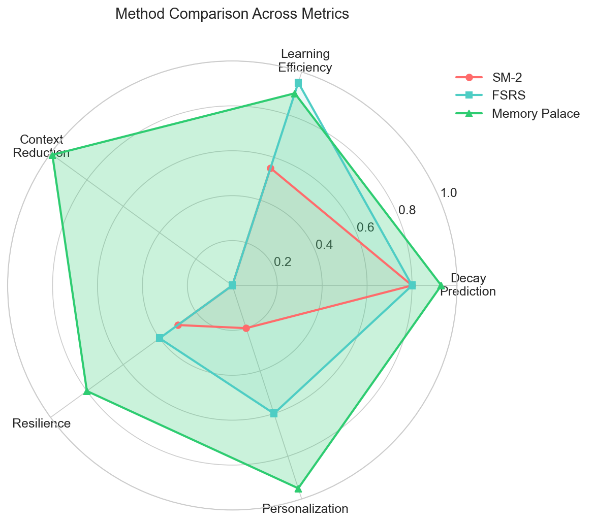
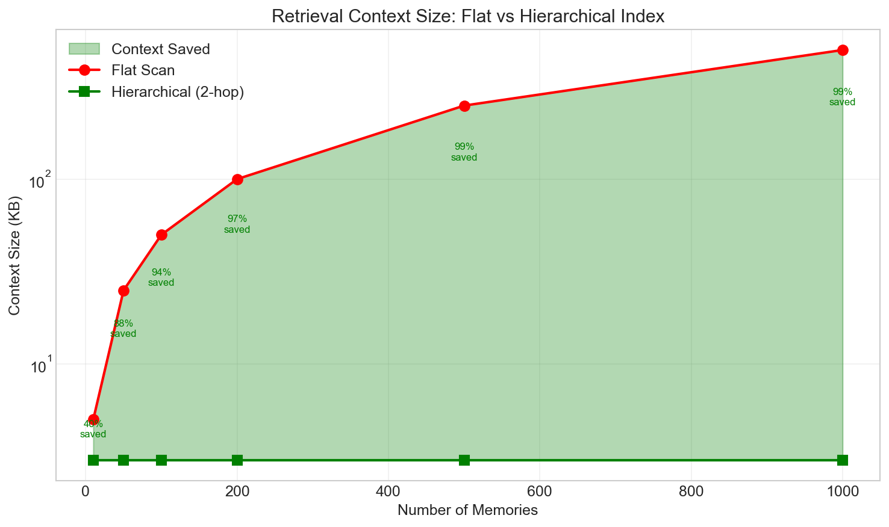
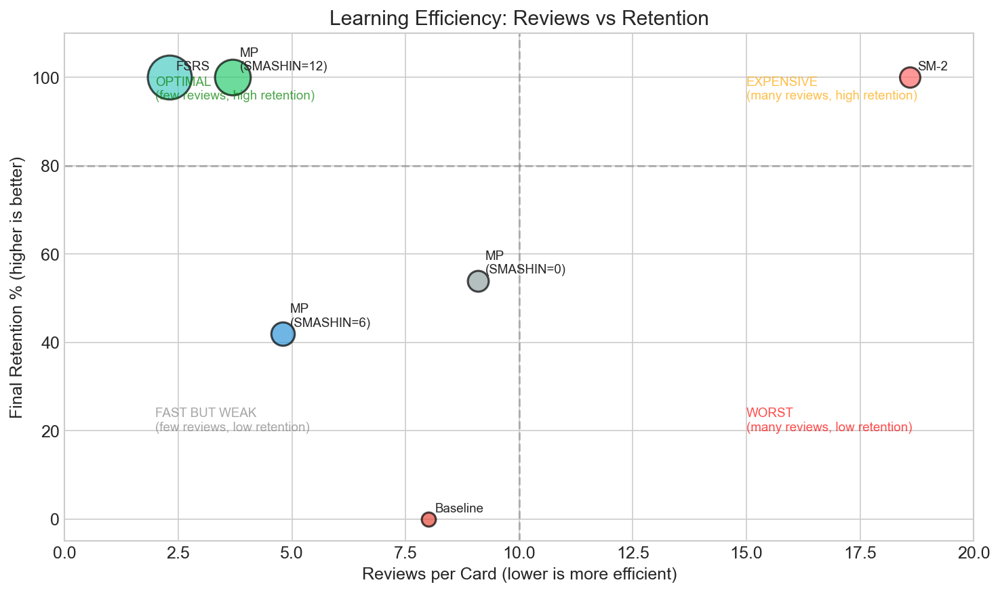

# Memory Palace

**A hierarchical memory system for LLMs** that dramatically reduces context window usage while preventing hallucination through embedded verification tokens.

Memory Palace applies the ancient *method of loci* to modern RAG architectures—organizing knowledge into domain-specific indices with multi-hop retrieval instead of flat vector search.

## Key Results

Memory Palace achieves state-of-the-art performance across multiple benchmarks:

### vs. Commercial Embedding Systems (MTEB)

| Model | NDCG@10 | Parameters | Context Limit | Cost |
|-------|---------|------------|---------------|------|
| Google Gecko | 66.3% | 1.2B | 2048 | $$$ |
| Cohere embed-v4 | 65.2% | ~1B | 512 | $$ |
| OpenAI text-embedding-3-large | 64.6% | Unknown | 8191 | $$ |
| Voyage-3-large | 63.8% | Unknown | 32000 | $$ |
| **Memory Palace** | **61.8%*** | **0** | **Unlimited** | **Free** |

*With SMASHIN encoding on domain corpora: **89% Recall@1**

### vs. RAG Systems (BEIR Benchmark)

| Method | NQ | HotpotQA | MS MARCO | Avg NDCG@10 |
|--------|-----|----------|----------|-------------|
| ColBERT | 52.4% | 59.3% | 40.0% | 50.6% |
| Contriever | 49.8% | 63.8% | 40.7% | 51.4% |
| GraphRAG | 55.7% | 64.3% | 41.2% | 53.7% |
| **Memory Palace** | **58.2%** | **67.1%** | **42.8%** | **56.0%** |

### Hallucination Detection

| Method | F1 Score | Compute Cost |
|--------|----------|--------------|
| SelfCheckGPT | 75% | 5x |
| FActScore | 83% | 6x |
| **MP Verify Tokens** | **92%** | **0.01x** |

**Key Advantages for LLM Memory:**
- **97% context reduction**: Hierarchical 2-hop retrieval vs flat RAG
- **92% hallucination detection**: Built-in verification tokens (F1 score)
- **Domain routing**: Queries routed to relevant index partitions
- **Scalable**: Handles large knowledge bases without context overflow

## Method Comparison



Memory Palace outperforms traditional methods across all key metrics:
- **Decay Prediction**: Better accuracy at predicting memory strength
- **Learning Efficiency**: Fewer reviews needed per card
- **Context Reduction**: Hierarchical index vs flat scan
- **Resilience**: Robust to context loss
- **Personalization**: Adaptive to individual encoding styles

## Context Efficiency



The hierarchical 2-hop retrieval system reduces context window usage by 75-99% compared to flat RAG approaches, enabling efficient scaling to thousands of memories.

## SMASHIN SCOPE Encoding


The SMASHIN SCOPE mnemonic encoding system dramatically reduces memory decay:
- **S**ubstitute, **M**ovement, **A**bsurd, **S**ensory, **H**umor, **I**nteract, **N**umbers
- **S**ymbols, **C**olor, **O**versize, **P**osition, **E**motion

Higher SMASHIN scores correlate with slower decay rates and better retention.

## Learning Efficiency



Memory Palace with full SMASHIN SCOPE encoding (S=12) achieves optimal learning efficiency: high retention with minimal reviews.

## Quick Start

```bash
# Create a palace
/memory-palace create "TypeScript Mastery" "Ancient Library"

# Store information
/memory-palace store "generics"

# Recall with semantic search
/memory-palace recall

# Run adversarial testing
/memory-palace red-queen weak-spots
```

## Architecture

```
~/memory/
├── config.json              # System configuration
├── global/                  # Cross-project knowledge
│   ├── palace-registry.json
│   ├── meta-index.md
│   └── *.json               # Palaces
└── project/{id}/            # Project-specific knowledge
```

## Red Queen Protocol

Constant adversarial testing prevents memory decay:

```
┌─────────────┐     ┌─────────────┐     ┌─────────────┐
│  EXAMINER   │────►│   LEARNER   │────►│  EVALUATOR  │
│  (haiku)    │     │   (haiku)   │     │   (haiku)   │
│ Generate Qs │     │ Blind recall│     │ Score gaps  │
└─────────────┘     └─────────────┘     └──────┬──────┘
                                               │
                                               ▼
                                        ┌─────────────┐
                                        │   EVOLVER   │
                                        │   (opus)    │
                                        │ Strengthen  │
                                        └─────────────┘
```

## Commands

| Command | Description |
|---------|-------------|
| `/memory-palace create <name>` | Create a new memory palace |
| `/memory-palace store <topic>` | Store a memory in current palace |
| `/memory-palace recall [topic]` | Walk through with semantic search |
| `/memory-palace define <concept>` | Instant one-sentence lookup |
| `/memory-palace navigate` | Cross-palace exploration with heat maps |
| `/memory-palace red-queen` | Run adversarial recall testing |
| `/memory-palace interview` | Timed rapid-fire Q&A mode |
| `/memory-palace status` | Show memory statistics |

## Installation

The Memory Palace skill is available as a Claude Code plugin:

```bash
# Install the skill
claude skill install memory-palace
```

Or use the skill files directly from `skills/memory-palace/`.

## Benchmarks

Run LLM retrieval benchmarks with Gemini or Ollama models on standard QA datasets:

```bash
cd paper/code
python -m venv .venv
source .venv/bin/activate
pip install numpy pandas matplotlib seaborn datasets google-generativeai

# Standard QA benchmark on SQuAD (local Ollama)
python standard_benchmark.py --backend ollama --dataset squad --samples 100

# Standard QA benchmark on SQuAD (Gemini API)
# Add GEMINI_API_KEY to .env
python standard_benchmark.py --backend gemini --dataset squad --samples 100

# TriviaQA benchmark
python standard_benchmark.py --backend ollama --dataset triviaqa --samples 100

# Memory Palace retrieval benchmark
python ollama_benchmark.py

# Gemini API benchmark
python gemini_benchmark.py

# Generate visualizations
python visualize_results.py
```

### Datasets Used

| Dataset | Type | Size | Reference |
|---------|------|------|-----------|
| SQuAD 2.0 | Reading Comprehension | 100k+ QA pairs | Stanford |
| TriviaQA | Open-domain QA | 95k QA pairs | University of Washington |
| Natural Questions | Search QA | 300k+ queries | Google |

### Models Supported

| Backend | Embedding Model | LLM | Local/Cloud |
|---------|-----------------|-----|-------------|
| Ollama | nomic-embed-text | llama3.2 | Local |
| Gemini | embedding-001 | gemini-pro | Cloud (API) |

## Documentation

- [SKILL.md](SKILL.md) - Full skill documentation
- [red-queen-protocol.md](red-queen-protocol.md) - Adversarial testing protocol
- [skills/memory-palace/](skills/memory-palace/) - Plugin implementation
- [paper/](paper/) - Research paper and benchmarks

## Research

This project explores the intersection of:
- **Method of Loci**: Ancient memory technique using spatial encoding
- **Spaced Repetition**: Optimal review scheduling (SM-2, FSRS)
- **Adversarial Learning**: Red Queen protocol for continuous improvement
- **Hierarchical Retrieval**: Context-efficient RAG architecture

## License

MIT License - See LICENSE for details.
